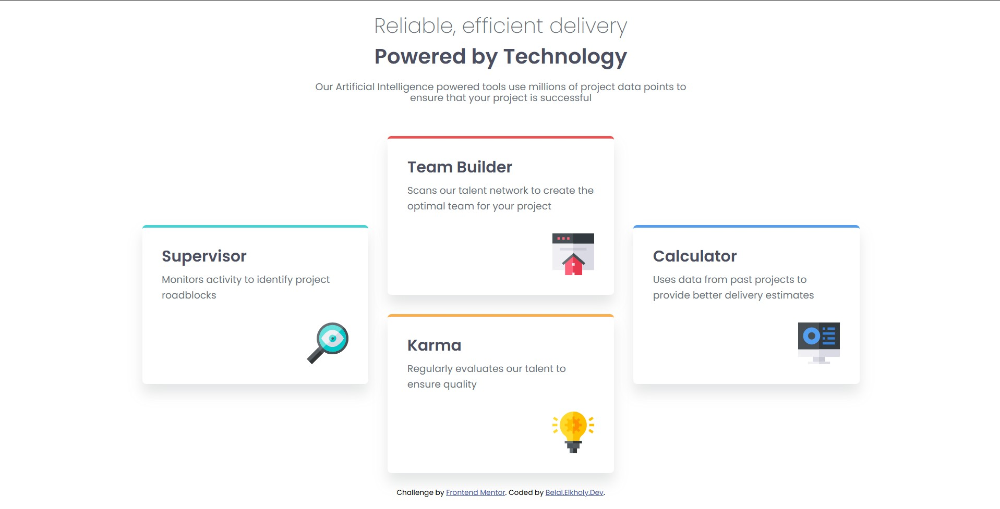

# Frontend Mentor - Four card feature section solution

This is a solution to the [Four card feature section challenge on Frontend Mentor](https://www.frontendmentor.io/challenges/four-card-feature-section-weK1eFYK). Frontend Mentor challenges help you improve your coding skills by building realistic projects.

## Table of contents

- [Overview](#overview)
  - [The challenge](#the-challenge)
  - [Screenshot](#screenshot)
  - [Links](#links)
- [My process](#my-process)
  - [Built with](#built-with)
  - [What I learned](#what-i-learned)
  - [Continued development](#continued-development)
  - [AI Collaboration](#ai-collaboration)
- [Author](#author)

## Overview

### The challenge

Users should be able to:

- View the optimal layout for the site depending on their device's screen size.
- See hover states for all interactive elements on the page.

### Screenshot



### Links

- Solution URL: [GitHub Repository](https://github.com/belal-elkholy-dev/four-card-feature-section)
- Live Site URL: [Vercel Live Site](https://four-card-feature-section-rouge-theta.vercel.app/)

## My process

### Built with

- Semantic HTML5 markup (utilizing `<main>`, `<header>`, and `<section>`)
- CSS custom properties (Variables for theming)
- CSS Flexbox (For sticky footer and internal component alignment)
- CSS Grid (For the complex desktop card layout)
- Mobile-first workflow
- Standardized Container widths for consistent UI across breakpoints
- Relative units (`rem`) for scalable and accessible typography

### What I learned

During this project, I focused heavily on writing Clean Code, adhering to DRY principles, and ensuring deep semantic accuracy. Some of my major takeaways include:

- **CSS Grid Strategy:** Delaying the CSS Grid implementation until the viewport is wide enough (e.g., `>= 992px`) to prevent text from being squeezed, greatly improving the UX on tablets.
- **Accessibility & Units:** Understanding exactly when to use `rem` (for fonts, padding, margins, and gaps) to support scalable layouts, and when to stick to `px` (for border-radius, thin borders, and box-shadows).
- **Semantic HTML:** Properly structuring the document without overusing `div`s. Using a single `<main>` tag, organizing intro text within a `<header>`, and grouping the cards inside a logical `<section>`.

```css
/* Delaying Grid for optimal UX and grouping Media Queries efficiently */
@media (min-width: 992px) {
  .cards {
    grid-template-columns: repeat(3, 1fr);
  }
  .cards .supervisor-card {
    grid-row: 1 / 3;
    align-self: center;
  }
  /* ...other card placements */
}
```

### Continued development

In future projects, I plan to continue refining my front-end skills while taking solid steps towards full-stack engineering. My upcoming focus areas include:

- **Advanced CSS & UI/UX:** Deepening my knowledge of responsive design patterns, CSS architecture, and accessibility (a11y).
- **JavaScript Mastery:** Strengthening algorithmic thinking and DOM manipulation to make components highly interactive.
- **Backend Technologies:** Expanding my stack by learning **Node.js** to build scalable full-stack applications.
- **Real-World Solutions:** Applying my skills to develop comprehensive web platforms and Software-as-a-Service (SaaS) projects to solve practical business needs.

### AI Collaboration

- **Tool used:** Google Gemini
- **How I used it:** I collaborated with Gemini as a "Senior Mentor" to discuss UI/UX best practices, validate my Semantic HTML structure, and refine my CSS architecture. We brainstormed responsive layout strategies and discussed clean code principles (DRY).
- **Outcome:** This collaboration helped me write a more robust, semantic, and professional codebase, focusing on the "why" behind the code rather than just making it visually identical.

## Author

- GitHub - [belal-elkholy-dev](https://github.com/belal-elkholy-dev)
- Frontend Mentor - [@belal-elkholy-dev](https://www.frontendmentor.io/profile/belal-elkholy-dev)
- LinkedIn - [Belal Elkholy](https://www.linkedin.com/in/belal-elkholy-64ab0b216/)
